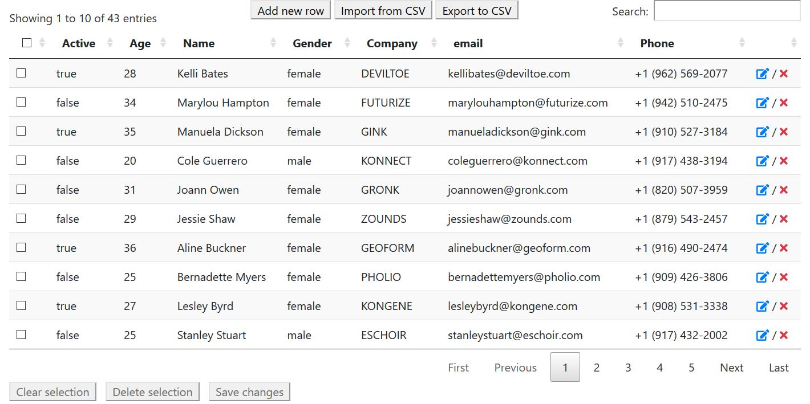
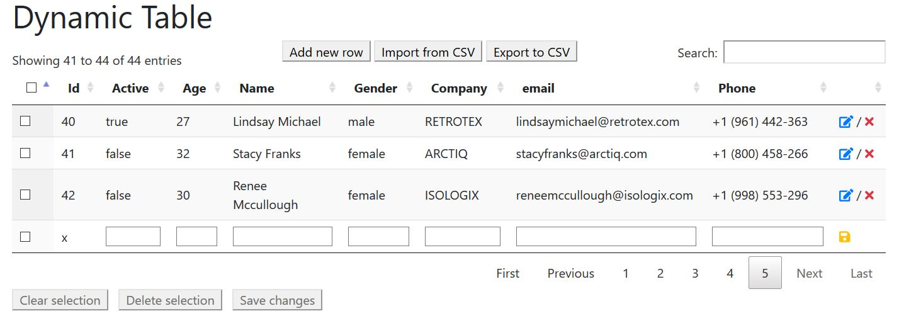

Lyre Dynamic Table JS
=====================

Use DataTables JS Plugin and jQuery 3.3.1 and higher

Features :
* client-side processing
* save changes to database
* pagination
* multi-selection
* inline row edition
* add new row (inline)

	* customisable new line HTML

